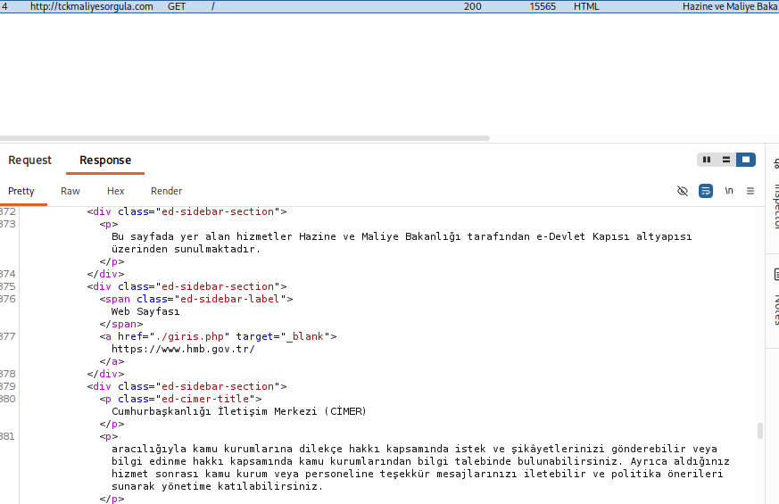
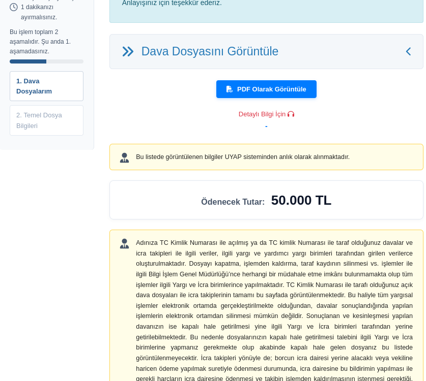
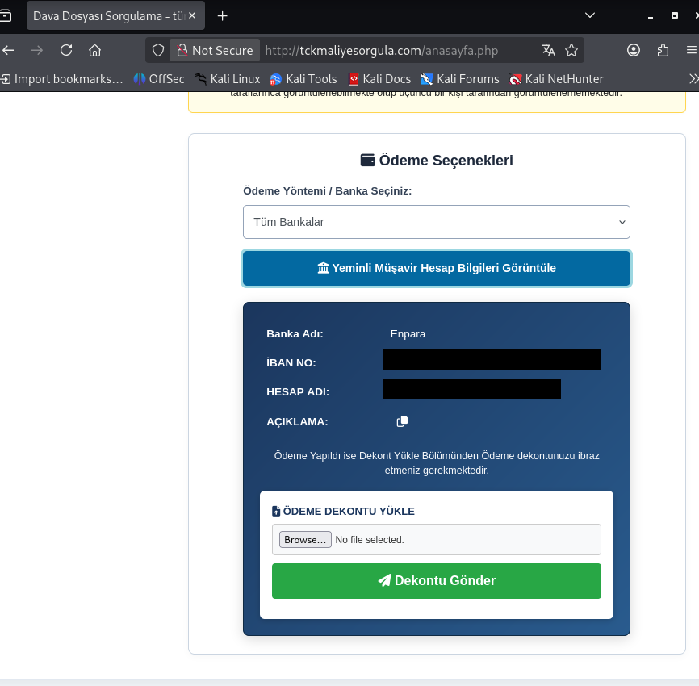
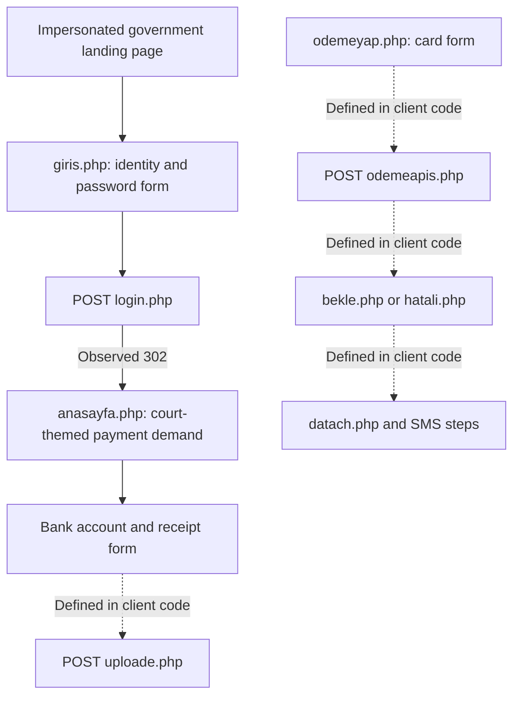

# e-Devlet Impersonation and Fraudulent Court Payment Demands

**Investigated domain:** `tckmaliyesorgula[.]com`  
**Author:** Coyot3Labs  
**Report date:** September 21, 2026  
**Evidence period:** September 15–20, 2026  
**Sources:** Supplied urlscan records, Kali tool output, HTML/JavaScript responses and Burp HTTP captures.

## Summary

The investigated website impersonated Turkey's e-Devlet portal and the Ministry of Treasury and Finance. Its login page requested a Turkish national identity number and an e-Devlet password. Two researcher submissions using synthetic data were followed by redirects to a court-case-themed page, which displayed a TRY 50,000 payment demand, bank account details and a receipt upload form.

Separate pages contained code for collecting payment card details and SMS codes. Those components establish what the client code was designed to submit; they do not demonstrate a completed card transaction, genuine SMS verification or receipt of funds. The operator's identity, victim count and server-side storage of submitted data were not established.

## Phishing Method

### Impersonation and a misleading official link

The landing page used public-sector logos, an e-Devlet-style header and a government service list. A link displayed the official-looking address `hmb[.]gov[.]tr`, but its actual destination was `./giris.php` on the investigated site. This kept visitors within the impersonation flow. **Evidence: 02, 28, 29.**

### Identity and password submission

The form on `/giris.php` was configured to submit `tridField` and `egpField` to `POST /login.php`. These corresponded to the identity-number and password fields. **Evidence: 17, 30.**

Supplementary Burp captures showed two researcher submissions receiving `302` responses with `Location: ./anasayfa.php`. Subsequent `GET /anasayfa.php` requests returned `200`. The test inputs were synthetic; reaching the next page did not require demonstrating valid e-Devlet credentials in these observations. Whether the application stored or forwarded the submitted values could not be determined from these responses.

Comparing the two returned HTML documents revealed a changing case number but identical case text and payment amount. The mechanism that generated the case number was not visible. See the [supplementary observations](../evidence/tckmaliyesorgula/notes/burp-observations.md).

### Payment pressure and receipt collection

The court-themed page claimed that bank accounts would be subject to restrictions if a penalty was not paid. It displayed a **TRY 50,000** amount and a button labelled “Yeminli Müşavir Hesap Bilgileri Görüntüle” — roughly, “View sworn financial adviser's account details.” The label does not establish that the account holder had that professional status or operated the site. **Evidence: 21, 31, 32.**

The receipt-upload code was configured to send a file as `uploadedFile` to `POST /uploade.php`. No file upload was performed to validate storage. The error-handling branch also displayed a success message, so the interface's success message alone would not prove that a file reached the server. **Evidence: 19–20.**

### Card and SMS components

Code on `/odemeyap.php` assembled the card number, cardholder name, expiration date and security code into a POST request to `/odemeapis.php`. It selected `/bekle.php` or `/hatali.php` based on the response. **Evidence: 22–24.**

Code on `/bekle.php` sent a POST request to `/datach.php` and selected SMS, success, error or payment pages based on returned text. The IP query value shown in the capture was the researcher's egress address and was redacted. A separate GET request returning no visible body did not validate the POST behavior. `/sms.php` contained a form for submitting an SMS code to itself. **Evidence: 18, 25–26.**

Dotted edges describe client-code behavior, rather than completed transactions. A direct transition from the bank-transfer flow to the card form was not established by this evidence set.

## Network and Infrastructure Analysis

| Observation | Evidence and interpretation |
|---|---|
| WHOIS creation time: September 15, 2026, 13:11:31 UTC | 07. Domain registration is not the creation date of all hosted files. |
| Registrar: NICENIC INTERNATIONAL GROUP CO., LIMITED | 07. Registration-provider metadata does not attribute the operation to the provider. |
| Nameservers: `frank.ns.cloudflare[.]com` and `reza.ns.cloudflare[.]com` | 06–07. NS records alone do not demonstrate that current web traffic passes through a proxy. |
| Main request IP in the September 15 urlscan capture: `188[.]114[.]96[.]3` | 01–03. A historical Cloudflare edge address, not a dedicated operator identifier. |
| Service IP associated with the domain in subsequent evidence: `217[.]60[.]195[.]104`, AS209373 | 01, 08–13. Physical location and status as an origin server were not independently confirmed. |
| HTTP server header: `Apache/2.4.52 (Ubuntu)` | 10, 12–13. A reported version string is not proof of a vulnerability. |
| TLS negotiation terminated after connection to TCP/443 | 10–12. No usable peer certificate was obtained in those tests. |
| Nmap reported an OpenSSH version on TCP/22 | 14. No SSH login was performed. Numerous other `tcpwrapped` entries do not establish the corresponding application services. |

The September 15 urlscan record showed HTTPS, while direct tests on September 17 showed TLS connection resets. These observations reflect different times and access conditions. Geolocation labels also differed between tools; no operator location was inferred from them.

### Exposed historical error log

The `/error_log` path returned `200`, and the supplied excerpt contained PHP errors dated 2023. Those entries predated the domain's 2026 registration. Reuse of older deployment files is a possible explanation, but the log's provenance and connection to the current operation were not established. These historical errors were not treated as evidence of a current SQL injection vulnerability. **Evidence: 15–16.**

### Administrator interface and redirect response body

The administrator login page used the title `deathfung Phishing | Admin Panel`. This was recorded as a page/kit artifact, not attributed to a particular person. **Evidence: 27.**

A supplementary response from `/admin/3d/dmn/` returned `302 Location: login.php` while also including administrator-interface HTML and payment-setting fields in its body. This exposed interface information during a redirect. It did not demonstrate an authenticated administrator session or access to the records referenced by the menus. A HEAD request to the receipt-listing path also redirected to the login page; its response did not establish the contents or accessibility of any receipt files.

## Indicators of Compromise

These indicators are tied to the evidence period. Consider address reassignment and shared hosting before operational use. [CSV version](../ioc/tckmaliyesorgula.csv).

| Type | Indicator | Context |
|---|---|---|
| Domain | `tckmaliyesorgula[.]com` | Government/e-Devlet impersonation pages |
| IPv4 | `217[.]60[.]195[.]104` | Service address associated with the domain during the investigation |
| URL | `hxxp[://]tckmaliyesorgula[.]com/giris.php` | Identity and password form |
| URL | `hxxp[://]tckmaliyesorgula[.]com/login.php` | Observed form submission endpoint |
| URL | `hxxp[://]tckmaliyesorgula[.]com/anasayfa.php` | Court-themed payment page |
| URL | `hxxp[://]tckmaliyesorgula[.]com/uploade.php` | Receipt submission endpoint defined in client code |
| URL | `hxxp[://]tckmaliyesorgula[.]com/odemeapis.php` | Card-data endpoint defined in client code |
| URL | `hxxp[://]tckmaliyesorgula[.]com/sms.php` | SMS-code form |
| URL | `hxxp[://]tckmaliyesorgula[.]com/datach.php` | Flow-control endpoint referenced in client code |
| URL | `hxxp[://]tckmaliyesorgula[.]com/admin/3d/dmn/login.php` | Administrator login interface |

Shared Cloudflare/CDN infrastructure, common libraries and the external image-hosting service were not classified as operator-specific malicious indicators. The Google Safe Browsing label visible in the urlscan screenshot is a captured third-party assessment, not a statement about the site's current status.

## Evidence and Limitations

The [evidence index](../evidence/tckmaliyesorgula/INDEX.md) maps the 32 screenshots to their observations. The [supplementary Burp note](../evidence/tckmaliyesorgula/notes/burp-observations.md) summarizes additional supplied responses; it is not a raw traffic export. Personal bank account information and the researcher's egress IP were redacted from publication copies.

The investigation did not establish real identity, card or SMS verification; successful transfers or receipt uploads; server-side credential storage; a victim count; or ownership of the operation by the named bank account holder. No SQL injection, server compromise or database access was demonstrated. Live infrastructure was not queried again while preparing this publication.
